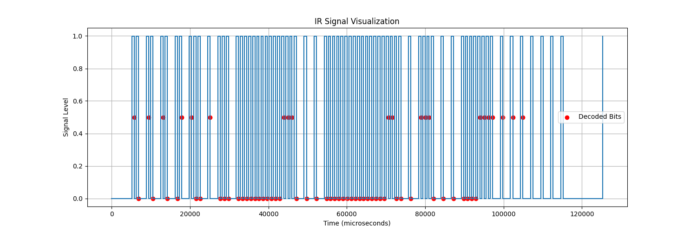

# Stiebel Eltron ACP 35 air conditioner

The goal is to integrate and make compatible the Stiebel Eltron ACP 35
air conditioner into the Home Assistant and/or ESPHome platform.
Perhaps via the climate platform
<https://esphome.io/components/climate/climate_ir.html> or
<https://github.com/jcwillox/hass-template-climate>.

A "clean room" black-box approach was used. Open source tools like ESPHome and a generic
IR receiver were used to decode the IR codes; avoiding proprietary tools or methods.
Methodologies of IR decoding are well documented and commonplace,
e.g. <http://www.harctoolbox.org/>, <https://blog.depau.eu/2021/06/12/ir-remote-reveng/>,
and <https://blog.flipper.net/infrared/>.

## ⚠️ Warning and Disclaimer ⚠️

Controlling a climate device using a method not approved or supported by the manufacturer
may void its warranty, interfere with normal operation and communication, decreased
performance, cause damage to the device, cause property or bodily harm, or even cause death.

The author(s) of this project (including, but not limited to, its methodology, content, and code)
are not responsible for any damage or injury caused. USE AT YOUR OWN RISK!

This project is not intended to be used as a substitute for professional advice or guidance.
Always consult a qualified technician or the manufacturer before attempting to control, modify,
or repair any device.

## Equipment

* [KinCony KC868-AG Infrared controller](https://www.kincony.com/kc868-ag-iot-ir-controller.html)
* Raspberry Pi 4 running Home Assistant and the ESPHome addon
* [Connected the KC868-AG to ESPHome](https://devices.esphome.io/devices/KinCony-KC868-AG)
* VS Code and Copilot for VSCode for editing and assistance
* Custom Python scripts to analyze and decode the IR signals captured by ESPHome
* Stiebel Eltron ACP 35 air conditioner —
  [info](https://www.stiebel-eltron.de/content/dam/ste/de/de/home/produkte/klima/ACP35_Produktinformation.pdf),
  [manual](https://www.stiebel-eltron.de/static/ste/docportal/manual/DM0000040581-fbg.pdf)

## IR signal basics

The ACP 35 IR remote control sampled was the manufacturer's remote control.
Inside the battery compartment is a sticker `TZ20160122`.

ESPHome identifies the ACP 35 IR signals with Pronto raw codes.

The ACP 35 does not use discrete IR codes for button presses. Instead, each IR transmission
sends the entire state of the air conditioner. This is common for climate devices,
e.g. Mitsubishi: <https://esphome.io/components/climate/climate_ir.html#mitsubishi>,
<https://esphome.io/api/mitsubishi_8cpp_source>

### Pronto raw IR semantics

Credit to Bengt Mårtensson <http://www.harctoolbox.org/Glossary.html#ProntoSemantics> for
documenting the Pronto raw IR semantics. Reproduced with permission below.

In general, an IR signal consists of three IR sequences, called

1. Start sequence (or "intro", or "beginning sequence"), sent exactly once at the beginning
   of the transmission of the IR signal,
2. Repeat sequence, sent "while the button is held down", i.e. zero or more times during the transmission
   of the IR signal (although some protocols may require at least one copy to be transmitted),
3. Ending sequence, sent exactly once at the end of the transmission of the IR signal,
   "when the button has been released". Only present in a few protocols.

Any sequence can be empty, but not both the start and the repeat. A non-empty ending sequence
is only meaningful with a non-empty repeat.

An IR signal in Pronto CCF form consists of a number of 4-digit hexadecimal numbers. For example:

```
0000 006C 0022 0002 015B 00AD 0016 0041 0016 0016 0016 0016 0016 0016 0016 0016 0016 0016 0016 0016 0016 0016 0016 0016 0016 0041 0016 0016 0016 0016 0016 0016 0016 0016 0016 0016 0016 0016 0016 0041 0016 0041 0016 0016 0016 0016 0016 0016 0016 0016 0016 0016 0016 0016 0016 0016 0016 0016 0016 0041 0016 0041 0016 0041 0016 0041 0016 0041 0016 0041 0016 06FB 015B 0057 0016 0E6C
```

The first number, here `0000`, denotes the type of the signal. `0000` denotes a raw IR signal with modulation,
while `0100` denotes a non-modulated raw IR signal. There are also a small number of other allowed values,
denoting signals in protocol/parameter form, notably `5000` for RC5-protocols, `6000` for RC6-protocols,
and `900A` for NEC1-protocols.

The second number, here `006C`, denotes a frequency code. For the frequency f in Hertz,
this is the number `1000000 / (f * 0.241246)` expressed as a four-digit hexadecimal number. In the example,
`006C` corresponds to `1000000 / (0x006c * 0.241246) = 38381 Hertz`.
(It can be conveniently computed by the Time/Frequency Calculator in
[IrScrutinizer](https://github.com/bengtmartensson/IrScrutinizer), available under the Tools menu.)

The third `0022` and fourth `0002` numbers denote the number of pairs (= half the number of durations) in the start
and the repeat sequence respectively. In the example, there are `0x0022` = 34 start pairs and `0x0002` = 2 repeat pairs.

Next the start and repeat sequences follow; their length being given by the third and the fourth numbers,
as per above. The numbers therein are all time durations, the ones with odd numbers on-periods, the other
ones off-periods. These are all expressed as multiples of the period time; the inverse value of the frequency
given as the second number. For this reason, "frequency" must be a non-zero number also for the non-modulated
case, denoted by the first number being `0100`. In the example, the fifth number `0x015B` denotes
an on-period of `0x015B * periodtime = 347/f = 347/38381 = 0.009041 seconds = 9041 microseconds`.

In particular, all sequences start with an on-period and end with an off-period.

In the Pronto representation, there is no way to express an ending sequence.

## IR protocol analysis

### Transmissions

All transmits have the same first 4 words `0000 006D 004A 0000` of Pronto codes.

* raw IR signal with modulation
* `6d` = 109 therefore `1000000 / (109 * 0.241246)` = `38028.866` = 38029 Hz
* 74 start pairs
* 0 repeat pairs

Pronto and raw IR codes can vary slightly due to timing and power variance.
As long as similar, it's OK.

In all the below IR samples, I never held down buttons. Therefore, there would be no repeat pairs.

As an experiment, I tested pressing up/down buttons and holding. The remote's UI increase/decreased
the temperature but there was no transmission until I released the button. Even then, the transmission
still started with `0000 006D 004A 0000`.

I believe the ACP 35 infrared protocol never sends repeats. Further supporting the protocol only sends
the final goal temperature instead of multiple discrete down or up temperature buttonm presses.

With dozens of transmissions analyzed, I believe values within the IR bitstream are transmitted
MSB (most significant bit) first. This document is written with the bitstreams in MSB first order,
meaning the MSB bits on the left are earliest in time.

### Pronto code analyzer

ESPHome has built-in IR receiver code which detects IR transmissions and decodes them.
I used this to capture the IR transmissions when I pressed buttons and retrieved the
corresponding Pronto codes using the ESPHome log for the KC868-AG Infrared controller.

The following transmission from the IR remote was captured while power was on,
mode was cool, fan was high, no timer, and up button pressed once to achieve 19c.

```
[21:02:45][I][remote.pronto:233]: 0000 006D 004A 0000 00C5 0017 0013 0017 004A 0017 0013 0017 004A 0017 0013 0017 004A 0017 0013 0017 004A 0017 0013 0016 0013 0016 004B 0017 004B 0015 0013 0015 0013 0016 004C 0015 0013 0015 0013 0015 0013 0015 0013 0015 0013 0015 
[21:02:45][I][remote.pronto:233]: 0013 0015 0013 0015 0013 0015 0013 0015 0013 0015 0013 0015 0013 0015 0013 0015 0013 0017 004B 0017 004B 0017 004B 0015 0013 0015 0013 0015 0013 0015 0013 0015 0013 0015 0013 0015 0013 0015 0013 0015 0013 0015 0013 0015 0013 0015 
[21:02:45][I][remote.pronto:233]: 0013 0015 0013 0015 0013 0015 0013 0015 0013 0015 0013 0015 0013 0017 004B 0017 004B 0015 0013 0015 0013 0015 0013 0017 004B 0017 004B 0017 004B 0015 0013 0015 0013 0015 0013 0015 0013 0015 0013 0015 0013 0015 0013 0017 004B 0017 
[21:02:45][I][remote.pronto:233]: 004B 0017 004B 0017 004B 0017 004B 0017 004B 0017 004B 0015 0181
```

A Python script `pronto_analyer.py` was created to analyze the Pronto IR codes for
frequency, sequence lengths, timing, and bitstream values. The text and image output
of the script is below.

```
Protocol: 0000 (Raw IR with modulation)
Frequency: 38028.9 Hz
Start sequence length: 74 pairs
Repeat sequence length: 0 pairs
Sequence length validation: FAILED
  Expected 152 codes, got 151 codes

Timing analysis:
ON pulses - Min: 499.6µs, Max: 10123.9µs, Avg: 1129.7µs
OFF pulses - Min: 552.2µs, Max: 604.8µs, Avg: 571.3µs

Binary representation (simplified):
10101001 10010000 00000000 00111000 00000000 00000001 10001110 00000011 11111
```



### Encoding bitstream

After dozens of transmissions, I believe the IR protocol is a bitstream
of 69 bits transmitted in the following time sequence

| sz | name       | description |
|----|:-----------|:------------|
| 5  | preamble   | `10101` |
| 4  | celsius    | offset from 16 (range 17-30c) MSB first |
| 1  | timer      | `0` = off/cancelled, `1` = active with given hours |
| 1  | 0          | `0` |
| 1  | power      | `0` = off, `1` = on |
| 4  | 0          | `0000` |
| 5  | hours      | timer duration in hours (range 0-24) MSB first |
| 3  | 0          | `000` |
| 5  | fahrenheit | offset from 59 (range 62-86f) MSB first |
| 16 | 0          | `0000000000000000` |
| 2  | 0          | `00` |
| 2  | fan        | `01` = low, `10` = medium, `11` = high |
| 2  | 0          | `00` |
| 2  | mode       | `00` = auto, `01` = cool, `10` = dry (also forces fan to low), `11` = fan |
| 1  | temp units | `0` = fahrenheit, `1` = celsius |
| 5  | 0          | `00000` |
| 1  | timer ui   | `0` = display standard ui, `1` = display timer ui |
| 1  | 0          | `0` |
| 8  | checksum   | ignore preamble, init with `01010101` 0x55, sum further all bytes MSB first, truncate to 8 bits |

Binary representation from `pronto_analyzer.py` aligned with the above table:

```
10101001 10010000 00000000 00111000 00000000 00000001 10001110 00000011 11111
     CCC CT P     HHHHH    FFFFF                    W W  MMU      R XXX XXXXX
     c    t p     hours    fahrenheit               fan  m u      t checksum
     e    i o                                            o n      i
     l    m w                                            d i      m
     s    e e                                            e t      e
     i    r r                                              s      r
     u                                                            u
     s                                                            i
```

#### Checksum

A python script `checksum.py` was created to analyze the Pronto IR codes for
possible checksum algorithms. The script takes the Pronto IR codes and tries
many different checksum algorithms to find the correct one.

The script identified the checksum algorithm as :

1. Ignore the 5-bit preamble
2. Group the next 64 bits into 8 bytes MSB first
3. Initialize a sum value with `0x55` (binary `01010101`)
4. Continue to sum the first 7 bytes
5. Truncate the sum to 8 bits
6. Compare the sum with the last byte (its checksum) of the Pronto IR code

```python
# Checksum algorithm: initialize sum with `01010101` 0x55, sum further all bytes, truncate to 8 bits
# 8. Test different starting values (common in CRCs)
for init in [0x00, 0x01, 0x05, 0x0A, 0x55, 0xAA, 0xFF]:
    checksum = init
    for byte in command_bytes:
        checksum = (checksum + byte) & 0xFF
    print(f"Sum with init 0x{init:02X}: 0x{checksum:02X} {'✓' if checksum == expected_checksum else '✗'}")
```

### Decoding state

A python script `decode.py` was created to decode the IR bitstream into the state of the air conditioner.
It accepts stdin multiline input and will look for the `pronto_analyzer.py` binary representation
of 8 groups of 8 bits then 5 bits.

```bash
echo "Lorem ipsum 10101001 10010000 00000000 00111000 00000000 00000001 10001110 00000011 11111" | ./decode.py
```

```
Found 1 bit patterns to analyze.

=== Processing Pattern 1 ===
10101001 10010000 00000000 00111000 00000000 00000001 10001110 00000011 11111

✅ Checksum Valid
  Expected: 0x7F, Calculated: 0x7F

=== Command Decoded ===
Power: ON
Mode: Cool
Temperature: 19°C (66°F)
Temperature Unit: Celsius
Fan Speed: High
Timer: Off, 0 hours
Display: Standard UI

=== Raw Values ===
Celsius Offset: 3 (Temp: 19°C)
Fahrenheit Offset: 7 (Temp: 66°F)
Power Bit: 1
Mode Bits: 01 (1)
Fan Speed Bits: 11 (3)
Temperature Unit Bit: 1
Timer Active Bit: 0
Timer Hours: 0
Timer UI Bit: 0

=== Binary Verification ===
Celsius: 0011 (offset 3)
Timer: 0 (Off)
Bit5: 0
Power: 1 (ON)
Zeros1: 0000
Hours: 00000 (0)
Zeros2: 000
Fahrenheit: 00111 (offset 7)
Zeros3: 0000000000000000
Zeros4: 00
Fan: 11 (3)
Zeros5: 00
Mode: 01 (1)
Temp Units: 1 (C)
Zeros6: 10000
Timer UI: 0 (Standard UI)
Bit55: 0
Checksum: 01111111 (0x7F)
```

The python scripts can be chained together to analyze pronto codes and decode the state of the air conditioner.

```bash
echo "0000 006D 004A 0000 00C5 0017 0013 0017 004A..." | ./pronto_analyzer.py | ./decode.py
```

```
Found 1 bit patterns to analyze.

=== Processing Pattern 1 ===
10101001 10010000 00000000 00111000 00000000 00000001 10001110 00000011 11111

✅ Checksum Valid
  Expected: 0x7F, Calculated: 0x7F

=== Command Decoded ===
Power: ON
Mode: Cool
...
```

## Transmission captures

### Power

```
On      10101011 00010000 00000000 01101000 00000000 00000001 10001100 01000011 11101
Off     10101011 00000000 00000000 01101000 00000000 00000001 10001100 01000011 11011
On      10101011 00010000 00000000 01101000 00000000 00000001 10001100 01000011 11101
                    X                                                             XX
                    0 = off
                    1 = on
```

Remote not being used -> On

```
[21:45:23][I][remote.pronto:233]: 0000 006D 004A 0000 00C2 0017 0013 0017 004A 0017 0013 0017 004A 0017 0013 0017 004A 0017 0013 0017 004A 0016 0013 0016 004B 0017 004B 0015 0013 0015 0013 0015 0013 0017 004B 0015 0013 0015 0013 0015 0013 0015 0013 0015 0013 0015 
[21:45:24][I][remote.pronto:233]: 0013 0015 0013 0015 0013 0015 0013 0015 0013 0015 0013 0015 0013 0015 0013 0017 004B 0017 004B 0015 0013 0017 004B 0015 0013 0015 0013 0015 0013 0015 0013 0015 0013 0015 0013 0015 0013 0015 0013 0015 0013 0015 0013 0015 0013 0015 
[21:45:24][I][remote.pronto:233]: 0013 0015 0013 0015 0013 0015 0013 0015 0013 0015 0013 0015 0013 0017 004B 0017 004B 0015 0013 0015 0013 0015 0013 0017 004B 0017 004B 0015 0013 0015 0013 0015 0013 0017 004B 0015 0013 0015 0013 0015 0013 0015 0013 0017 004B 0017 
[21:45:24][I][remote.pronto:233]: 004B 0017 004B 0017 004B 0017 004B 0015 0013 0017 004B 0015 0181 
```

On -> Off

```
[22:19:46][I][remote.pronto:233]: 0000 006D 004A 0000 00C5 0017 0013 0017 004A 0017 0013 0017 004A 0017 0013 0017 004A 0017 0013 0017 004A 0017 0013 0017 004A 0018 004A 0016 0013 0015 0013 0015 0013 0015 0013 0015 0013 0014 0014 0014 0014 0014 0014 0014 0014 0014 
[22:19:46][I][remote.pronto:233]: 0014 0014 0014 0014 0014 0014 0014 0014 0014 0014 0014 0014 0014 0014 0014 0016 004C 0016 004C 0014 0014 0016 004C 0014 0014 0014 0014 0014 0014 0014 0014 0014 0014 0014 0014 0014 0014 0014 0014 0014 0014 0014 0014 0014 0014 0014 
[22:19:46][I][remote.pronto:233]: 0014 0014 0014 0014 0014 0014 0014 0014 0014 0014 0014 0014 0014 0016 004C 0016 004C 0014 0014 0014 0014 0014 0014 0016 004C 0016 004C 0014 0014 0014 0014 0014 0014 0016 004C 0014 0014 0014 0014 0014 0014 0014 0014 0016 004C 0016 
[22:19:46][I][remote.pronto:233]: 004C 0016 004C 0016 004C 0014 0014 0016 004C 0016 004C 0014 0181 
```

Off -> On

```
[22:22:02][I][remote.pronto:233]: 0000 006D 004A 0000 00C5 0017 0013 0017 004A 0017 0013 0017 004A 0017 0013 0016 004A 0017 0013 0016 004B 0016 0013 0016 004B 0017 004B 0015 0013 0015 0013 0015 0013 0016 004C 0015 0013 0015 0013 0015 0013 0015 0013 0015 0013 0015 
[22:22:02][I][remote.pronto:233]: 0013 0015 0013 0015 0013 0015 0013 0015 0013 0015 0013 0015 0013 0015 0013 0017 004B 0017 004B 0015 0013 0017 004B 0015 0013 0015 0013 0015 0013 0015 0013 0015 0013 0015 0013 0015 0013 0015 0013 0015 0013 0015 0013 0015 0013 0015 
[22:22:02][I][remote.pronto:233]: 0013 0015 0013 0015 0013 0015 0013 0015 0013 0015 0013 0015 0013 0017 004B 0017 004B 0015 0013 0015 0013 0015 0013 0017 004B 0017 004B 0015 0013 0015 0013 0015 0013 0017 004B 0015 0013 0015 0013 0015 0013 0015 0013 0017 004B 0017 
[22:22:02][I][remote.pronto:233]: 004B 0017 004B 0017 004B 0017 004B 0015 0013 0017 004B 0015 0181 
```

### Timer

Remote UI has a 2-step sequence; pressing timer button sends the below code and then remote
has a UI that wants a time period. Period is in hours 0-24.
At any time, pressing timer button cancels the existing/new timer and returns to default UI.
Otherwise, select the number of hours with up/down and then wait several seconds
for the default UI to reappear. The remote UI now has a timer indicator.
Pressing timer button will show the number of hours ?remaining?. To keep the timer
active, press nothing. Pressing the timer button again will cancel the timer and return to default UI.

Binary representation (simplified):
compare 75f    10101100 00010000 00000000 10000000 00000000 00000001 10001010 00000010 11000
Press timer    10101100 01010000 00000000 10000000 00000000 00000001 10001000 00010001 00010  ...then immediately...
Press timer    10101100 00010000 00000000 10000000 00000000 00000001 10001000 00000000 11000  result is default UI
                         ?                                                 ?     ?  XX XX X

Press timer    10101100 01010000 00000000 10000000 00000000 00000001 10001000 00010001 00010
up = 1hr       10101100 01010000 00001000 10000000 00000000 00000001 10001000 00010001 00011
up = 2hr       10101100 01010000 00010000 10000000 00000000 00000001 10001000 00010001 00100  ...and wait to accept and return to default UI
                                    ??                                                   XXX

up = 24hr      10101100 01010000 11000000 10000000 00000000 00000001 10001000 00010001 11010
                                 ??                                        ?     ?  XX XXXXX

Press timer    10101100 01010000 11000000 10000000 00000000 00000001 10001000 00011001 11011  ...then immediately...
Press timer    10101100 00010000 00000000 10000000 00000000 00000001 10001000 00000000 11000
                         ?       ??                                              ??  ?    ??

Press timer    10101100 01010000 00000000 10000000 00000000 00000001 10001000 00010001 00010
Up = 1 hr      10101100 01010000 00001000 10000000 00000000 00000001 10001000 00010001 00011  ...and wait to accept and return to default UI
Press fan=med  10101100 01010000 00001000 10000000 00000000 00000001 00001000 00000000 10001
                         ?           ?                               W           ?   X X  XX

Press timer...
Up -> 15 hr    10101100 01010000 01111000 10000000 00000000 00000001 00001000 00010001 00001
                                  ????                                           ?   X X

                    CCC CT P     HHHHH    FFFFF                    W W  MMU      R XXX XXXXX
                  celsiust power hours    fahrenheit               fan  m u      c
                         i                                              o n      h
                         m                                              d i      o
                         e                                              e t      r
                         r                                                s      d

From normal operation cool 75f high fan, press timer (and its waiting on the length in the remote UI)

```
[23:43:26][I][remote.pronto:233]: 0000 006D 004A 0000 00C5 0017 0013 0017 004A 0017 0013 0017 004A 0017 0013 0017 004A 0017 0013 0017 004A 0018 004A 0017 0013 0016 0013 0015 0013 0016 004B 0015 0013 0016 004C 0015 0013 0014 0014 0015 0013 0014 0014 0014 0014 0014 
[23:43:26][I][remote.pronto:233]: 0014 0015 0013 0015 0013 0014 0014 0015 0013 0014 0014 0014 0014 0017 004B 0015 0013 0014 0014 0015 0013 0014 0014 0014 0014 0014 0014 0015 0013 0014 0014 0015 0013 0014 0014 0015 0013 0014 0014 0014 0014 0015 0013 0014 0014 0014 
[23:43:26][I][remote.pronto:233]: 0014 0015 0013 0014 0014 0015 0013 0014 0014 0014 0014 0014 0014 0017 004B 0017 004B 0015 0013 0014 0014 0014 0014 0017 004B 0014 0014 0014 0014 0014 0014 0014 0014 0014 0014 0014 0014 0017 004B 0015 0013 0014 0014 0014 0014 0017 
[23:43:26][I][remote.pronto:233]: 004B 0014 0014 0014 0014 0014 0014 0017 004B 0014 0014 0015 0181
```

press timer, up, up, wait

```
[01:05:12][I][remote.pronto:233]: 0000 006D 004A 0000 00C5 0017 0013 0017 004A 0017 0013 0017 004A 0017 0013 0017 004A 0017 0013 0017 004A 0018 004A 0017 0013 0016 0013 0015 0013 0016 004B 0015 0013 0016 004B 0015 0013 0015 0013 0014 0014 0015 0013 0015 0013 0014 
[01:05:12][I][remote.pronto:233]: 0014 0015 0013 0015 0013 0015 0013 0014 0014 0015 0013 0015 0013 0017 004B 0015 0013 0015 0013 0015 0013 0015 0013 0015 0013 0015 0013 0015 0013 0015 0013 0015 0013 0015 0013 0015 0013 0014 0014 0014 0014 0014 0014 0014 0014 0015 
[01:05:12][I][remote.pronto:233]: 0013 0014 0014 0014 0014 0014 0014 0015 0013 0015 0013 0014 0014 0017 004B 0017 004B 0014 0014 0014 0014 0014 0014 0017 004B 0015 0013 0015 0013 0014 0014 0014 0014 0015 0013 0015 0013 0017 004B 0014 0014 0014 0014 0014 0014 0017 
[01:05:12][I][remote.pronto:233]: 004B 0014 0014 0014 0014 0014 0014 0017 004B 0014 0014 0015 0181

[01:05:13][I][remote.pronto:233]: 0000 006D 004A 0000 00C5 0017 0013 0017 004A 0017 0013 0017 004A 0017 0013 0017 004A 0017 0013 0017 004A 0018 004A 0017 0013 0016 0013 0016 0013 0016 004B 0015 0013 0016 004C 0015 0013 0015 0013 0014 0014 0015 0013 0015 0013 0015 
[01:05:13][I][remote.pronto:233]: 0013 0015 0013 0015 0013 0017 004B 0015 0013 0015 0013 0015 0013 0017 004B 0015 0013 0015 0013 0015 0013 0014 0014 0014 0014 0015 0013 0014 0014 0015 0013 0015 0013 0015 0013 0015 0013 0015 0013 0015 0013 0015 0013 0015 0013 0015 
[01:05:13][I][remote.pronto:233]: 0013 0015 0013 0015 0013 0014 0014 0014 0014 0014 0014 0014 0014 0017 004B 0017 004B 0014 0014 0014 0014 0015 0013 0017 004B 0014 0014 0014 0014 0015 0013 0014 0014 0015 0013 0014 0014 0017 004B 0014 0014 0014 0014 0014 0014 0017 
[01:05:13][I][remote.pronto:233]: 004B 0014 0014 0014 0014 0014 0014 0017 004B 0017 004B 0014 0181

[01:05:14][I][remote.pronto:233]: 0000 006D 004A 0000 00C5 0017 0013 0017 004A 0017 0013 0017 004A 0017 0013 0017 004A 0017 0013 0017 004A 0018 004A 0017 0013 0016 0013 0015 0013 0016 004B 0015 0013 0016 004C 0015 0013 0015 0013 0015 0013 0015 0013 0015 0013 0015 
[01:05:14][I][remote.pronto:233]: 0013 0015 0013 0017 004B 0014 0014 0015 0013 0015 0013 0015 0013 0017 004B 0015 0013 0015 0013 0015 0013 0014 0014 0014 0014 0015 0013 0015 0013 0015 0013 0015 0013 0015 0013 0015 0013 0014 0014 0015 0013 0015 0013 0015 0013 0015 
[01:05:14][I][remote.pronto:233]: 0013 0015 0013 0015 0013 0014 0014 0015 0013 0014 0014 0014 0014 0017 004B 0017 004B 0015 0013 0014 0014 0014 0014 0017 004B 0014 0014 0014 0014 0014 0014 0015 0013 0014 0014 0015 0013 0017 004B 0014 0014 0014 0014 0014 0014 0017 
[01:05:14][I][remote.pronto:233]: 004B 0014 0014 0014 0014 0017 004B 0014 0014 0014 0014 0014 0181
```

power off, power on, (it is at cool 75f max fan), press timer
press up 24 times to get 24 hrs, wait

24th...

```
[01:26:03][I][remote.pronto:233]: 0000 006D 004A 0000 00C5 0017 0013 0017 004A 0017 0013 0017 004A 0017 0013 0017 004A 0017 0013 0017 004A 0018 004A 0017 0013 0015 0013 0015 0013 0016 004B 0015 0013 0016 004C 0015 0013 0015 0013 0015 0013 0015 0013 0017 004B 0017 
[01:26:03][I][remote.pronto:233]: 004B 0015 0013 0015 0013 0015 0013 0015 0013 0015 0013 0015 0013 0017 004B 0015 0013 0015 0013 0015 0013 0015 0013 0015 0013 0015 0013 0015 0013 0015 0013 0015 0013 0015 0013 0015 0013 0015 0013 0015 0013 0015 0013 0015 0013 0015 
[01:26:03][I][remote.pronto:233]: 0013 0015 0013 0015 0013 0015 0013 0015 0013 0015 0013 0015 0013 0017 004B 0017 004B 0015 0013 0015 0013 0015 0013 0017 004B 0015 0013 0015 0013 0015 0013 0015 0013 0015 0013 0015 0013 0017 004B 0015 0013 0015 0013 0015 0013 0017 
[01:26:03][I][remote.pronto:233]: 004B 0017 004B 0017 004B 0015 0013 0017 004B 0015 0013 0015 0181
```

...then timer, timer, to cancel the existin 24hr timer

```
[01:35:53][I][remote.pronto:233]: 0000 006D 004A 0000 00C5 0017 0013 0017 004A 0017 0013 0017 004A 0017 0013 0017 004A 0017 0013 0017 004A 0018 004A 0017 0013 0016 0013 0015 0013 0016 004B 0015 0013 0016 004C 0015 0013 0015 0013 0015 0013 0015 0013 0017 004B 0017 
[01:35:53][I][remote.pronto:233]: 004B 0015 0013 0015 0013 0015 0013 0015 0013 0015 0013 0015 0013 0017 004B 0015 0013 0015 0013 0015 0013 0015 0013 0015 0013 0015 0013 0015 0013 0015 0013 0015 0013 0015 0013 0015 0013 0015 0013 0015 0013 0015 0013 0015 0013 0015 
[01:35:53][I][remote.pronto:233]: 0013 0015 0013 0015 0013 0015 0013 0015 0013 0015 0013 0015 0013 0017 004B 0017 004B 0015 0013 0015 0013 0015 0013 0017 004B 0015 0013 0015 0013 0015 0013 0015 0013 0015 0013 0015 0013 0017 004B 0017 004B 0015 0013 0015 0013 0017 
[01:35:53][I][remote.pronto:233]: 004B 0017 004B 0017 004B 0015 0013 0017 004B 0017 004B 0014 0181 

[01:35:54][I][remote.pronto:233]: 0000 006D 004A 0000 00C5 0017 0013 0017 004A 0017 0013 0017 004A 0017 0013 0017 004A 0017 0013 0017 004A 0018 004A 0017 0013 0016 0013 0015 0013 0015 0013 0015 0013 0016 004C 0015 0013 0015 0013 0015 0013 0015 0013 0015 0013 0015 
[01:35:54][I][remote.pronto:233]: 0013 0015 0013 0015 0013 0015 0013 0015 0013 0015 0013 0015 0013 0017 004B 0015 0013 0015 0013 0015 0013 0015 0013 0015 0013 0015 0013 0015 0013 0015 0013 0015 0013 0015 0013 0015 0013 0015 0013 0015 0013 0015 0013 0015 0013 0015 
[01:35:54][I][remote.pronto:233]: 0013 0015 0013 0015 0013 0015 0013 0015 0013 0015 0013 0014 0014 0017 004B 0017 004B 0014 0014 0015 0013 0014 0014 0017 004B 0015 0013 0014 0014 0015 0013 0015 0013 0015 0013 0015 0013 0014 0014 0015 0013 0015 0013 0015 0013 0014 
[01:35:54][I][remote.pronto:233]: 0014 0017 004B 0017 004B 0015 0013 0015 0013 0015 0013 0015 0181
```

### Celsius or Fahrenheit units

Press C -> F

```
[21:48:36][I][remote.pronto:233]: 0000 006D 004A 0000 00C5 0017 0013 0017 004A 0017 0013 0017 004A 0017 0013 0017 004A 0017 0013 0017 004A 0016 0013 0016 004B 0017 004C 0015 0013 0015 0013 0015 0013 0017 004B 0015 0013 0015 0013 0015 0013 0015 0013 0015 0013 0015 
[21:48:36][I][remote.pronto:233]: 0013 0015 0013 0015 0013 0015 0013 0015 0013 0015 0013 0015 0013 0015 0013 0017 004B 0017 004B 0015 0013 0017 004B 0015 0013 0015 0013 0015 0013 0015 0013 0015 0013 0015 0013 0015 0013 0015 0013 0015 0013 0015 0013 0015 0013 0015 
[21:48:36][I][remote.pronto:233]: 0013 0015 0013 0015 0013 0015 0013 0015 0013 0015 0013 0015 0013 0017 004B 0017 004B 0015 0013 0015 0013 0015 0013 0017 004B 0015 0013 0015 0013 0015 0013 0015 0013 0015 0013 0015 0013 0015 0013 0015 0013 0017 004B 0017 004B 0017 
[21:48:36][I][remote.pronto:233]: 004B 0017 004B 0015 0013 0017 004B 0015 0013 0017 004B 0015 0181 
```

Press F -> C

```
[21:54:24][I][remote.pronto:233]: 0000 006D 004A 0000 00C4 0017 0013 0017 004A 0017 0013 0017 004A 0017 0013 0016 004A 0016 0013 0016 004B 0016 0013 0016 004B 0016 004C 0015 0013 0015 0013 0015 0013 0017 004B 0015 0013 0015 0013 0015 0013 0015 0013 0015 0013 0015 
[21:54:24][I][remote.pronto:233]: 0013 0015 0013 0015 0013 0015 0013 0015 0013 0015 0013 0015 0013 0015 0013 0017 004B 0017 004B 0015 0013 0017 004B 0015 0013 0015 0013 0015 0013 0015 0013 0015 0013 0015 0013 0015 0013 0015 0013 0015 0013 0015 0013 0015 0013 0015 
[21:54:24][I][remote.pronto:233]: 0013 0015 0013 0015 0013 0015 0013 0015 0013 0015 0013 0015 0013 0017 004B 0017 004B 0015 0013 0015 0013 0015 0013 0017 004B 0017 004B 0015 0013 0015 0013 0015 0013 0015 0013 0015 0013 0015 0013 0015 0013 0015 0013 0017 004B 0017 
[21:54:24][I][remote.pronto:233]: 004B 0017 004B 0015 0013 0017 004B 0015 0013 0017 004B 0015 0181 
```

```
c -> f    10101011 00010000 00000000 01101000 00000000 00000001 10001000 00000111 10101
f -> c    10101011 00010000 00000000 01101000 00000000 00000001 10001100 00000011 10101
                                                                     X        X
                                Unit where 0 = fahrenheit, 1 = celsius
```

### Temperature values

Celsius temperature can range from 17c to 30c with increments of 1c on remote control.
It is coded and transmitted as 4 bits, with a range of decimal 1-14.
That value is added to 16c. I never detected 0000 aka 16c.

```
17c    10101000 10010000 00000000 00011000 00000000 00000001 10001110 00000010 11011    62.6f
18c    10101001 00010000 00000000 00101000 00000000 00000001 10001110 00000011 01101    64.4f
19c    10101001 10010000 00000000 00111000 00000000 00000001 10001110 00000011 11111    66.2f
20c    10101010 00010000 00000000 01001000 00000000 00000001 10001110 00000100 10001    68.0f
21c    10101010 10010000 00000000 01011000 00000000 00000001 10001110 00000101 00011    69.8f
22c    10101011 00010000 00000000 01101000 00000000 00000001 10001110 00000101 10101    71.6f
23c    10101011 10010000 00000000 01110000 00000000 00000001 10001110 00000110 00110    73.4f
24c    10101100 00010000 00000000 10000000 00000000 00000001 10001110 00000110 11000    75.2f
25c    10101100 10010000 00000000 10010000 00000000 00000001 10001110 00000111 01010    77.0f
26c    10101101 00010000 00000000 10100000 00000000 00000001 10001110 00000111 11100    78.8f
27c    10101101 10010000 00000000 10110000 00000000 00000001 10001110 00000000 01110    80.6f
28c    10101110 00010000 00000000 10111000 00000000 00000001 10001110 00000000 11111    82.4f
29c    10101110 10010000 00000000 11001000 00000000 00000001 10001110 00000001 10001    84.2f
30c    10101111 00010000 00000000 11011000 00000000 00000001 10001110 00000010 00011    86.0f
            XXX X                 XXXXX                           X        XXX XXXXX
            Celsius offset        Fahrenheit offset   Unit 0=f, 1=c
```

Fahrenheit temperature can range from 62f to 86f with increments of 1f on remote control.
It is coded and transmitted as 5 bits, with a range of decimal 3-27.
That value is added to 59f. I never detected 00000 - 00010 aka 59-61f.

```
62f    10101000 10010000 00000000 00011000 00000000 00000001 10001010 00000110 11011    16.7c
63f    10101000 10010000 00000000 00100000 00000000 00000001 10001010 00000110 11100    17.2c
64f    10101001 00010000 00000000 00101000 00000000 00000001 10001010 00000111 01101    17.8c
...
75f    10101100 00010000 00000000 10000000 00000000 00000001 10001010 00000010 11000    23.9c
...
86f    10101111 00010000 00000000 11011000 00000000 00000001 10001010 00000110 00011    30.0c
            XXX X                 XXXXX                           X        XXX XXXXX
            Celsius offset        Fahrenheit offset   Unit 0=f, 1=c
```

#### Encoding process

Celsius and Fahrenheit values are both always transmitted.

1. Choose the temperature unit: 0 bit = Fahrenheit, 1 bit = Celsius
2. Given a unit, choose the temperature value ranging from 17-30c or 62-86f.
3. Convert that value to the other unit
   * Celsius to Fahrenheit `value = (temperature value * 9/5) + 32` and round to nearest integer
   * Fahrenheit to Celsius `value = (temperature value - 32) * 5/9` and round to nearest integer
4. Convert the temperature values to offsets
   * Celsius `offset = temperature value - 16`
   * Fahrenheit `offset = temperature value - 59`
5. Convert the offsets to bits, most significant bit first

#### Celsius samples

When in cool mode, caused 22c -> 23

```
[21:56:57][I][remote.pronto:233]: 0000 006D 004A 0000 00C5 0017 0013 0017 004A 0017 0013 0017 004A 0017 0013 0017 004A 0017 0013 0017 004A 0017 0013 0017 004A 0017 004B 0017 004B 0016 0013 0015 0013 0016 004C 0015 0013 0015 0013 0015 0013 0015 0013 0015 0013 0015 
[21:56:57][I][remote.pronto:233]: 0013 0015 0013 0015 0013 0015 0013 0015 0013 0015 0013 0015 0013 0015 0013 0017 004B 0017 004B 0017 004B 0015 0013 0015 0013 0015 0013 0015 0013 0015 0013 0015 0013 0015 0013 0015 0013 0015 0013 0015 0013 0015 0013 0015 0013 0015 
[21:56:57][I][remote.pronto:233]: 0013 0015 0013 0015 0013 0015 0013 0015 0013 0015 0013 0015 0013 0017 004B 0017 004B 0015 0013 0015 0013 0015 0013 0017 004B 0017 004B 0017 004B 0015 0013 0015 0013 0015 0013 0015 0013 0015 0013 0015 0013 0017 004B 0017 004B 0015 
[21:56:57][I][remote.pronto:233]: 0013 0015 0013 0015 0013 0017 004B 0017 004B 0015 0013 0015 0181 
```

When in cool mode, caused 23c -> 22

```
[21:58:24][I][remote.pronto:233]: 0000 006D 004A 0000 00C5 0017 0013 0017 004A 0017 0013 0017 004A 0017 0013 0017 004A 0017 0013 0017 004A 0017 0013 0017 004A 0018 004B 0016 0013 0015 0013 0015 0013 0016 004C 0015 0013 0015 0013 0015 0013 0015 0013 0015 0013 0015 
[21:58:24][I][remote.pronto:233]: 0013 0015 0013 0015 0013 0015 0013 0015 0013 0015 0013 0015 0013 0015 0013 0017 004B 0017 004B 0015 0013 0017 004B 0015 0013 0015 0013 0015 0013 0015 0013 0015 0013 0015 0013 0015 0013 0015 0013 0014 0014 0015 0013 0015 0013 0015 
[21:58:24][I][remote.pronto:233]: 0013 0015 0013 0015 0013 0014 0014 0015 0013 0015 0013 0015 0013 0017 004B 0017 004B 0015 0013 0015 0013 0014 0014 0017 004B 0017 004B 0017 004B 0014 0014 0014 0014 0014 0014 0015 0013 0014 0014 0014 0014 0017 004B 0014 0014 0017 
[21:58:24][I][remote.pronto:233]: 004B 0017 004B 0015 0013 0017 004B 0014 0014 0017 004B 0014 0181 
```

When in cool mode, was at 17c, kept pressing down and it kept at 17c

```
[20:47:54][I][remote.pronto:233]: 0000 006D 004A 0000 00C5 0017 0013 0017 004A 0017 0013 0017 004A 0017 0013 0017 004A 0017 0013 0017 004A 0017 0013 0016 0013 0016 0013 0016 004B 0016 0013 0015 0013 0016 004C 0015 0013 0014 0014 0014 0014 0014 0014 0014 0014 0014 
[20:47:54][I][remote.pronto:233]: 0014 0014 0014 0014 0014 0014 0014 0014 0014 0014 0014 0014 0014 0014 0014 0014 0014 0014 0014 0016 004C 0016 004C 0014 0014 0014 0014 0014 0014 0014 0014 0014 0014 0014 0014 0014 0014 0014 0014 0014 0014 0014 0014 0014 0014 0014 
[20:47:54][I][remote.pronto:233]: 0014 0014 0014 0014 0014 0014 0014 0014 0014 0014 0014 0014 0014 0016 004C 0016 004C 0014 0014 0014 0014 0014 0014 0016 004C 0016 004C 0016 004C 0014 0014 0014 0014 0014 0014 0014 0014 0014 0014 0014 0014 0014 0014 0016 004C 0014 
[20:47:54][I][remote.pronto:233]: 0014 0016 004C 0016 004C 0014 0014 0016 004C 0016 004C 0014 0181
```

up once to 18c

```
[20:58:43][I][remote.pronto:233]: 0000 006D 004A 0000 00C5 0017 0013 0017 004A 0017 0013 0017 004A 0017 0013 0017 004A 0017 0013 0016 004A 0016 0013 0015 0013 0016 004C 0015 0013 0015 0013 0015 0013 0016 004C 0015 0013 0015 0013 0015 0013 0015 0013 0015 0013 0015 
[20:58:43][I][remote.pronto:233]: 0013 0015 0013 0015 0013 0015 0013 0015 0013 0015 0013 0015 0013 0015 0013 0015 0013 0017 004B 0015 0013 0017 004B 0015 0013 0015 0013 0015 0013 0015 0013 0015 0013 0015 0013 0015 0013 0015 0013 0015 0013 0015 0013 0015 0013 0015 
[20:58:43][I][remote.pronto:233]: 0013 0015 0013 0015 0013 0015 0013 0015 0013 0015 0013 0015 0013 0017 004B 0017 004B 0015 0013 0015 0013 0015 0013 0017 004B 0017 004B 0017 004B 0015 0013 0015 0013 0015 0013 0015 0013 0015 0013 0015 0013 0015 0013 0017 004B 0017 
[20:58:43][I][remote.pronto:233]: 004B 0015 0013 0017 004B 0017 004B 0015 0013 0017 004B 0015 0181
```

up once to 19c

```
[21:02:45][I][remote.pronto:233]: 0000 006D 004A 0000 00C5 0017 0013 0017 004A 0017 0013 0017 004A 0017 0013 0017 004A 0017 0013 0017 004A 0017 0013 0016 0013 0016 004B 0017 004B 0015 0013 0015 0013 0016 004C 0015 0013 0015 0013 0015 0013 0015 0013 0015 0013 0015 
[21:02:45][I][remote.pronto:233]: 0013 0015 0013 0015 0013 0015 0013 0015 0013 0015 0013 0015 0013 0015 0013 0015 0013 0017 004B 0017 004B 0017 004B 0015 0013 0015 0013 0015 0013 0015 0013 0015 0013 0015 0013 0015 0013 0015 0013 0015 0013 0015 0013 0015 0013 0015 
[21:02:45][I][remote.pronto:233]: 0013 0015 0013 0015 0013 0015 0013 0015 0013 0015 0013 0015 0013 0017 004B 0017 004B 0015 0013 0015 0013 0015 0013 0017 004B 0017 004B 0017 004B 0015 0013 0015 0013 0015 0013 0015 0013 0015 0013 0015 0013 0015 0013 0017 004B 0017 
[21:02:45][I][remote.pronto:233]: 004B 0017 004B 0017 004B 0017 004B 0017 004B 0017 004B 0015 0181
```

up to 20c

```
[21:17:33][I][remote.pronto:233]: 0000 006D 004A 0000 00C5 0017 0013 0017 004A 0017 0013 0017 004A 0017 0013 0017 004A 0017 0013 0017 004A 0016 0013 0016 004B 0016 0013 0015 0013 0015 0013 0015 0013 0016 004C 0015 0013 0015 0013 0015 0013 0015 0013 0015 0013 0015 
[21:17:33][I][remote.pronto:233]: 0013 0015 0013 0015 0013 0015 0013 0015 0013 0015 0013 0015 0013 0015 0013 0017 004B 0015 0013 0015 0013 0017 004B 0015 0013 0015 0013 0015 0013 0015 0013 0015 0013 0015 0013 0015 0013 0015 0013 0015 0013 0015 0013 0015 0013 0015 
[21:17:33][I][remote.pronto:233]: 0013 0015 0013 0015 0013 0015 0013 0015 0013 0015 0013 0015 0013 0017 004B 0017 004B 0015 0013 0015 0013 0015 0013 0017 004B 0017 004B 0017 004B 0015 0013 0015 0013 0015 0013 0015 0013 0015 0013 0015 0013 0017 004B 0015 0013 0015 
[21:17:33][I][remote.pronto:233]: 0013 0017 004B 0015 0013 0015 0013 0015 0013 0017 004B 0015 0181 
```

up to 21c

```
[21:27:58][I][remote.pronto:233]: 0000 006D 004A 0000 00C4 0017 0013 0017 004A 0017 0013 0017 004A 0017 0013 0017 004A 0017 0013 0017 004A 0017 0013 0016 004B 0016 0013 0016 004B 0015 0013 0015 0013 0016 004C 0015 0013 0015 0013 0015 0013 0015 0013 0015 0013 0015 
[21:27:58][I][remote.pronto:233]: 0013 0015 0013 0015 0013 0015 0013 0015 0013 0015 0013 0015 0013 0015 0013 0017 004B 0015 0013 0017 004B 0017 004B 0015 0013 0015 0013 0015 0013 0015 0013 0015 0013 0015 0013 0015 0013 0015 0013 0015 0013 0015 0013 0015 0013 0015 
[21:27:58][I][remote.pronto:233]: 0013 0015 0013 0015 0013 0015 0013 0015 0013 0015 0013 0015 0013 0017 004B 0017 004B 0015 0013 0015 0013 0015 0013 0017 004B 0017 004B 0017 004B 0015 0013 0015 0013 0015 0013 0015 0013 0015 0013 0015 0013 0017 004B 0015 0013 0017 
[21:27:58][I][remote.pronto:233]: 004B 0015 0013 0015 0013 0015 0013 0017 004B 0017 004B 0015 0181 
```

up to 24c

```
[21:30:49][I][remote.pronto:233]: 0000 006D 004A 0000 00C5 0017 0013 0017 004A 0017 0013 0017 004A 0017 0013 0017 004A 0017 0013 0017 004A 0018 004A 0017 0013 0015 0013 0015 0013 0015 0013 0015 0013 0016 004C 0015 0013 0015 0013 0015 0013 0015 0013 0015 0013 0015 
[21:30:49][I][remote.pronto:233]: 0013 0015 0013 0015 0013 0015 0013 0015 0013 0015 0013 0015 0013 0017 004B 0015 0013 0015 0013 0015 0013 0015 0013 0015 0013 0015 0013 0015 0013 0015 0013 0015 0013 0015 0013 0015 0013 0015 0013 0015 0013 0015 0013 0015 0013 0015 
[21:30:49][I][remote.pronto:233]: 0013 0015 0013 0015 0013 0015 0013 0015 0013 0015 0013 0015 0013 0017 004B 0017 004B 0015 0013 0015 0013 0015 0013 0017 004B 0017 004B 0017 004B 0015 0013 0015 0013 0015 0013 0015 0013 0015 0013 0015 0013 0017 004B 0017 004B 0015 
[21:30:49][I][remote.pronto:233]: 0013 0017 004B 0017 004B 0015 0013 0015 0013 0015 0013 0015 0181
```

up to 25c

```
[21:33:33][I][remote.pronto:233]: 0000 006D 004A 0000 00C5 0017 0013 0017 004A 0017 0013 0017 004A 0017 0013 0017 004A 0017 0013 0017 004A 0018 004A 0017 0013 0016 0013 0016 004A 0016 0013 0015 0013 0016 004C 0014 0014 0014 0014 0014 0014 0014 0014 0014 0014 0014 
[21:33:33][I][remote.pronto:233]: 0014 0014 0014 0014 0014 0014 0014 0014 0014 0014 0014 0014 0014 0016 004C 0014 0014 0014 0014 0016 004C 0014 0014 0014 0014 0014 0014 0014 0014 0014 0014 0014 0014 0014 0014 0014 0014 0014 0014 0014 0014 0014 0014 0014 0014 0014 
[21:33:33][I][remote.pronto:233]: 0014 0014 0014 0014 0014 0014 0014 0014 0014 0014 0014 0014 0014 0016 004C 0016 004C 0014 0014 0014 0014 0014 0014 0016 004C 0016 004C 0016 004C 0014 0014 0014 0014 0014 0014 0014 0014 0014 0014 0014 0014 0016 004C 0016 004C 0016 
[21:33:33][I][remote.pronto:233]: 004C 0014 0014 0016 004C 0014 0014 0016 004C 0014 0014 0014 0181
```

up to 26c

```
[21:36:46][I][remote.pronto:233]: 0000 006D 004A 0000 00C5 0017 0013 0017 004A 0017 0013 0017 004A 0017 0013 0017 004A 0017 0013 0017 004A 0018 004A 0017 0013 0016 004A 0016 0013 0015 0013 0015 0013 0016 004C 0014 0014 0014 0014 0014 0014 0014 0014 0014 0014 0014 
[21:36:46][I][remote.pronto:233]: 0014 0014 0014 0014 0014 0014 0014 0014 0014 0014 0014 0014 0014 0016 004C 0014 0014 0016 004C 0014 0014 0014 0014 0014 0014 0014 0014 0014 0014 0014 0014 0014 0014 0014 0014 0014 0014 0014 0014 0014 0014 0014 0014 0014 0014 0014 
[21:36:46][I][remote.pronto:233]: 0014 0014 0014 0014 0014 0014 0014 0014 0014 0014 0014 0014 0014 0016 004C 0016 004C 0014 0014 0014 0014 0014 0014 0016 004C 0016 004C 0016 004C 0014 0014 0014 0014 0014 0014 0014 0014 0014 0014 0014 0014 0016 004C 0016 004C 0016 
[21:36:46][I][remote.pronto:233]: 004C 0016 004C 0016 004C 0016 004C 0014 0014 0014 0014 0014 0181
```

up to 27c

```
[21:38:20][I][remote.pronto:233]: 0000 006D 004A 0000 00C5 0017 0013 0017 004A 0017 0013 0017 004A 0017 0013 0017 004A 0017 0013 0017 004A 0018 004A 0017 0013 0016 004A 0017 004B 0016 0013 0015 0013 0016 004B 0014 0014 0014 0014 0014 0014 0014 0014 0014 0014 0014 
[21:38:20][I][remote.pronto:233]: 0014 0014 0014 0014 0014 0014 0014 0014 0014 0014 0014 0014 0014 0016 004C 0014 0014 0016 004C 0016 004C 0014 0014 0014 0014 0014 0014 0014 0014 0014 0014 0014 0014 0014 0014 0014 0014 0014 0014 0014 0014 0014 0014 0014 0014 0014 
[21:38:20][I][remote.pronto:233]: 0014 0014 0014 0014 0014 0014 0014 0014 0014 0014 0014 0014 0014 0016 004C 0016 004C 0014 0014 0014 0014 0014 0014 0016 004C 0016 004C 0016 004C 0014 0014 0014 0014 0014 0014 0014 0014 0014 0014 0014 0014 0014 0014 0014 0014 0014 
[21:38:20][I][remote.pronto:233]: 0014 0014 0014 0016 004C 0016 004C 0016 004C 0014 0014 0014 0181
```

up to 28c

```
[21:39:47][I][remote.pronto:233]: 0000 006D 004A 0000 00C5 0017 0013 0017 004A 0017 0013 0017 004A 0017 0013 0017 004A 0017 0013 0017 004A 0018 004A 0018 004A 0016 0013 0015 0013 0015 0013 0015 0013 0016 004C 0015 0013 0015 0013 0015 0013 0015 0013 0015 0013 0015 
[21:39:47][I][remote.pronto:233]: 0013 0015 0013 0015 0013 0015 0013 0015 0013 0015 0013 0015 0013 0017 004B 0015 0013 0017 004B 0017 004B 0017 004B 0015 0013 0015 0013 0015 0013 0015 0013 0015 0013 0015 0013 0015 0013 0015 0013 0015 0013 0015 0013 0015 0013 0015 
[21:39:47][I][remote.pronto:233]: 0013 0015 0013 0015 0013 0015 0013 0015 0013 0015 0013 0015 0013 0017 004B 0017 004B 0015 0013 0015 0013 0015 0013 0017 004B 0017 004B 0017 004B 0015 0013 0015 0013 0015 0013 0015 0013 0015 0013 0015 0013 0015 0013 0015 0013 0015 
[21:39:47][I][remote.pronto:233]: 0013 0017 004B 0017 004B 0017 004B 0017 004B 0017 004B 0015 0181
```

up to 29c

```
[21:41:25][I][remote.pronto:233]: 0000 006D 004A 0000 00C5 0017 0013 0017 004A 0017 0013 0017 004A 0017 0013 0017 004A 0017 0013 0017 004A 0018 004A 0018 004A 0016 0013 0016 004B 0016 0013 0015 0013 0016 004C 0015 0013 0015 0013 0015 0013 0015 0013 0015 0013 0015 
[21:41:25][I][remote.pronto:233]: 0013 0015 0013 0015 0013 0015 0013 0015 0013 0015 0013 0015 0013 0017 004B 0017 004B 0015 0013 0015 0013 0017 004B 0015 0013 0015 0013 0015 0013 0015 0013 0015 0013 0015 0013 0015 0013 0015 0013 0015 0013 0015 0013 0015 0013 0015 
[21:41:25][I][remote.pronto:233]: 0013 0015 0013 0015 0013 0015 0013 0015 0013 0015 0013 0015 0013 0017 004B 0017 004B 0015 0013 0015 0013 0015 0013 0017 004B 0017 004B 0017 004B 0015 0013 0015 0013 0015 0013 0015 0013 0015 0013 0015 0013 0015 0013 0015 0013 0017 
[21:41:25][I][remote.pronto:233]: 004B 0017 004B 0015 0013 0015 0013 0015 0013 0017 004B 0015 0181
```

up to 30c

```
[21:42:55][I][remote.pronto:233]: 0000 006D 004A 0000 00C5 0017 0013 0017 004A 0017 0013 0017 004A 0017 0013 0017 004A 0017 0013 0017 004A 0018 004A 0018 004A 0018 004A 0016 0013 0015 0013 0015 0013 0016 004C 0015 0013 0015 0013 0014 0014 0015 0013 0015 0013 0014 
[21:42:55][I][remote.pronto:233]: 0014 0015 0013 0014 0014 0015 0013 0015 0013 0014 0014 0015 0013 0017 004B 0017 004B 0014 0014 0017 004B 0017 004B 0015 0013 0014 0014 0015 0013 0015 0013 0015 0013 0014 0014 0014 0014 0014 0014 0014 0014 0014 0014 0014 0014 0015 
[21:42:55][I][remote.pronto:233]: 0013 0014 0014 0014 0014 0014 0014 0014 0014 0014 0014 0014 0014 0016 004C 0017 004B 0014 0014 0014 0014 0014 0014 0017 004B 0017 004B 0016 004C 0014 0014 0014 0014 0014 0014 0014 0014 0014 0014 0014 0014 0014 0014 0016 004C 0014 
[21:42:55][I][remote.pronto:233]: 0014 0014 0014 0014 0014 0014 0014 0016 004C 0016 004C 0014 0181 
```

#### Farenheit samples

Down to 62f

```
[21:57:50][I][remote.pronto:233]: 0000 006D 004A 0000 00C5 0017 0013 0017 004A 0017 0013 0017 004A 0017 0013 0017 004A 0017 0013 0017 004A 0017 0013 0016 0013 0016 0013 0016 004B 0016 0013 0015 0013 0016 004C 0015 0013 0014 0014 0014 0014 0014 0014 0014 0014 0014 
[21:57:50][I][remote.pronto:233]: 0014 0014 0014 0014 0014 0014 0014 0014 0014 0014 0014 0014 0014 0014 0014 0014 0014 0014 0014 0016 004C 0016 004C 0014 0014 0014 0014 0014 0014 0014 0014 0014 0014 0014 0014 0014 0014 0014 0014 0014 0014 0014 0014 0014 0014 0014 
[21:57:50][I][remote.pronto:233]: 0014 0014 0014 0014 0014 0014 0014 0014 0014 0014 0014 0014 0014 0016 004C 0016 004C 0014 0014 0014 0014 0014 0014 0016 004C 0014 0014 0016 004C 0014 0014 0014 0014 0014 0014 0014 0014 0014 0014 0014 0014 0016 004C 0016 004C 0014 
[21:57:50][I][remote.pronto:233]: 0014 0016 004C 0016 004C 0014 0014 0016 004C 0016 004C 0014 0181```
```

Up to 63f

```
[22:03:56][I][remote.pronto:233]: 0000 006D 004A 0000 00C5 0017 0013 0017 004A 0017 0013 0017 004A 0017 0013 0017 004A 0017 0013 0017 004A 0017 0013 0016 0013 0015 0013 0016 004B 0016 0013 0015 0013 0016 004C 0015 0013 0014 0014 0014 0014 0014 0014 0014 0014 0014 
[22:03:56][I][remote.pronto:233]: 0014 0014 0014 0014 0014 0014 0014 0014 0014 0014 0014 0014 0014 0014 0014 0014 0014 0016 004C 0014 0014 0014 0014 0014 0014 0014 0014 0014 0014 0014 0014 0014 0014 0014 0014 0014 0014 0014 0014 0014 0014 0014 0014 0014 0014 0014 
[22:03:56][I][remote.pronto:233]: 0014 0014 0014 0014 0014 0014 0014 0014 0014 0014 0014 0014 0014 0016 004C 0016 004C 0014 0014 0014 0014 0014 0014 0016 004C 0014 0014 0016 004C 0014 0014 0014 0014 0014 0014 0014 0014 0014 0014 0014 0014 0016 004C 0016 004C 0014 
[22:03:56][I][remote.pronto:233]: 0014 0016 004C 0017 004B 0016 004C 0014 0014 0014 0014 0014 0181 
```

Up to 64f

```
[22:13:45][I][remote.pronto:233]: 0000 006D 004A 0000 00C4 0017 0013 0017 004A 0017 0013 0016 004A 0017 0013 0016 004A 0017 0013 0016 004A 0016 0013 0015 0013 0016 004B 0015 0013 0015 0013 0015 0013 0016 004C 0015 0013 0015 0013 0015 0013 0015 0013 0015 0013 0015 
[22:13:45][I][remote.pronto:233]: 0013 0015 0013 0015 0013 0015 0013 0015 0013 0015 0013 0015 0013 0015 0013 0015 0013 0017 004B 0015 0013 0017 004B 0015 0013 0015 0013 0015 0013 0015 0013 0015 0013 0015 0013 0015 0013 0015 0013 0015 0013 0015 0013 0015 0013 0015 
[22:13:45][I][remote.pronto:233]: 0013 0015 0013 0015 0013 0015 0013 0015 0013 0015 0013 0015 0013 0017 004B 0017 004B 0015 0013 0015 0013 0015 0013 0017 004B 0015 0013 0017 004B 0015 0013 0015 0013 0015 0013 0015 0013 0015 0013 0015 0013 0017 004B 0017 004B 0017 
[22:13:45][I][remote.pronto:233]: 004B 0015 0013 0017 004B 0017 004B 0015 0013 0017 004B 0015 0181
```

Jump up to 86f

```
[22:21:00][I][remote.pronto:233]: 0000 006D 004A 0000 00C5 0017 0013 0017 004A 0017 0013 0017 004A 0017 0013 0017 004A 0017 0013 0017 004A 0018 004A 0018 004A 0017 004B 0016 0013 0015 0013 0015 0013 0016 004C 0015 0013 0015 0013 0015 0013 0015 0013 0015 0013 0015 
[22:21:00][I][remote.pronto:233]: 0013 0015 0013 0015 0013 0015 0013 0015 0013 0015 0013 0015 0013 0017 004B 0017 004B 0015 0013 0017 004B 0017 004B 0015 0013 0015 0013 0015 0013 0015 0013 0015 0013 0015 0013 0015 0013 0015 0013 0015 0013 0015 0013 0014 0014 0015 
[22:21:00][I][remote.pronto:233]: 0013 0015 0013 0015 0013 0015 0013 0015 0013 0015 0013 0015 0013 0017 004B 0017 004B 0015 0013 0015 0013 0014 0014 0017 004B 0015 0013 0017 004B 0015 0013 0015 0013 0014 0014 0014 0014 0015 0013 0015 0013 0017 004B 0017 004B 0014 
[22:21:00][I][remote.pronto:233]: 0014 0015 0013 0015 0013 0015 0013 0017 004B 0017 004B 0014 0181
```

Jump down to 75f

```
[22:26:23][I][remote.pronto:233]: 0000 006D 004A 0000 00C5 0017 0013 0017 004A 0017 0013 0017 004A 0017 0013 0017 004A 0017 0013 0017 004A 0018 004A 0017 0013 0016 0013 0016 0013 0015 0013 0015 0013 0016 004C 0015 0013 0015 0013 0014 0014 0014 0014 0014 0014 0014 
[22:26:23][I][remote.pronto:233]: 0014 0014 0014 0014 0014 0014 0014 0014 0014 0014 0014 0014 0014 0016 004C 0014 0014 0014 0014 0014 0014 0014 0014 0014 0014 0014 0014 0014 0014 0014 0014 0014 0014 0014 0014 0014 0014 0014 0014 0014 0014 0014 0014 0014 0014 0014 
[22:26:23][I][remote.pronto:233]: 0014 0014 0014 0014 0014 0014 0014 0014 0014 0014 0014 0014 0014 0016 004C 0016 004C 0014 0014 0014 0014 0014 0014 0016 004C 0014 0014 0016 004C 0014 0014 0014 0014 0014 0014 0014 0014 0014 0014 0014 0014 0014 0014 0016 004C 0014 
[22:26:23][I][remote.pronto:233]: 0014 0016 004C 0016 004C 0014 0014 0014 0014 0014 0014 0014 0181 
```

### Fan

Remote's fan button cycles from high -> medium -> low.
I pressed button on remote and received codes below.

```
High     10101011 00010000 00000000 01101000 00000000 00000001 10001100 00000011 10101
Medium   10101011 00010000 00000000 01101000 00000000 00000001 00001100 00000011 00101
Low      10101011 00010000 00000000 01101000 00000000 00000000 10001100 00000010 10101

                                                             X X               X X 
                                                             1 1 = 3 for high
                                                             1 0 = 2 for medium
                                                             0 1 = 1 for low
```

High -> Medium

```
[22:17:22][I][remote.pronto:233]: 0000 006D 004A 0000 00C5 0017 0013 0017 004A 0017 0013 0017 004A 0017 0013 0017 004A 0017 0013 0017 004A 0017 0013 0017 004A 0018 004A 0016 0013 0015 0013 0015 0013 0016 004B 0015 0013 0015 0013 0014 0014 0014 0014 0015 0013 0014 
[22:17:22][I][remote.pronto:233]: 0014 0014 0014 0014 0014 0014 0014 0014 0014 0015 0013 0014 0014 0014 0014 0016 004C 0016 004C 0014 0014 0016 004C 0014 0014 0014 0014 0014 0014 0014 0014 0014 0014 0014 0014 0014 0014 0014 0014 0014 0014 0014 0014 0014 0014 0014 
[22:17:22][I][remote.pronto:233]: 0014 0014 0014 0014 0014 0014 0014 0014 0014 0014 0014 0014 0014 0017 004B 0014 0014 0014 0014 0014 0014 0014 0014 0017 004B 0017 004B 0014 0014 0014 0014 0015 0013 0014 0014 0015 0013 0014 0014 0015 0013 0015 0013 0017 004B 0017 
[22:17:22][I][remote.pronto:233]: 004B 0014 0014 0014 0014 0017 004B 0015 0013 0017 004B 0014 0181
```

Medium -> Low

```
[22:18:07][I][remote.pronto:233]: 0000 006D 004A 0000 00C5 0017 0013 0016 004A 0016 0013 0016 004B 0016 0013 0016 004B 0016 0013 0016 004B 0015 0013 0016 004C 0016 004C 0015 0013 0015 0013 0015 0013 0017 004B 0015 0013 0015 0013 0015 0013 0015 0013 0015 0013 0015 
[22:18:07][I][remote.pronto:233]: 0013 0015 0013 0015 0013 0015 0013 0015 0013 0015 0013 0015 0013 0015 0013 0017 004B 0017 004B 0015 0013 0017 004B 0015 0013 0015 0013 0015 0013 0015 0013 0015 0013 0015 0013 0015 0013 0015 0013 0015 0013 0015 0013 0015 0013 0015 
[22:18:07][I][remote.pronto:233]: 0013 0015 0013 0015 0013 0015 0013 0015 0013 0015 0013 0015 0013 0015 0013 0017 004B 0015 0013 0015 0013 0015 0013 0017 004B 0017 004B 0015 0013 0015 0013 0015 0013 0015 0013 0015 0013 0015 0013 0015 0013 0015 0013 0017 004B 0015 
[22:18:07][I][remote.pronto:233]: 0013 0017 004B 0015 0013 0017 004B 0015 0013 0017 004B 0015 0181
```

Low -> High

```
[22:18:37][I][remote.pronto:233]: 0000 006D 004A 0000 00C5 0017 0013 0017 004A 0017 0013 0017 004A 0017 0013 0017 004A 0017 0013 0017 004A 0017 0013 0017 004A 0018 004A 0016 0013 0015 0013 0015 0013 0016 004C 0014 0014 0014 0014 0014 0014 0014 0014 0014 0014 0014 
[22:18:37][I][remote.pronto:233]: 0014 0014 0014 0014 0014 0014 0014 0014 0014 0014 0014 0014 0014 0014 0014 0016 004C 0016 004C 0014 0014 0016 004C 0014 0014 0014 0014 0014 0014 0014 0014 0014 0014 0014 0014 0014 0014 0014 0014 0014 0014 0014 0014 0014 0014 0014 
[22:18:37][I][remote.pronto:233]: 0014 0014 0014 0014 0014 0014 0014 0014 0014 0014 0014 0014 0014 0016 004C 0016 004C 0014 0014 0014 0014 0014 0014 0016 004C 0016 004C 0014 0014 0014 0014 0014 0014 0014 0014 0014 0014 0014 0014 0014 0014 0014 0014 0016 004C 0016 
[22:18:37][I][remote.pronto:233]: 004C 0016 004C 0014 0014 0016 004C 0014 0014 0016 004C 0014 0181 
```

### Mode

Remote started with mode=cool and 22c and high fan

```
Fan         10101011 00010000 00000000 01101000 00000000 00000001 10011100 00000011 10111
Dry         10101011 00010000 00000000 01101000 00000000 00000000 10010100 00000010 10110
Auto        10101011 00010000 00000000 01101000 00000000 00000001 10000100 00000011 10100
Cool        10101011 00010000 00000000 01101000 00000000 00000001 10001100 00000011 10101
                                                                X    XX           X    XX
                                                                     00 = 0 for auto
                                                                     01 = 1 for cool
                                                                !    10 = 2 for dry (notice remote forced fan to low)
                                                                     11 = 3 for fan
```

Cool -> Fan

```
[22:28:11][I][remote.pronto:233]: 0000 006D 004A 0000 00C5 0017 0013 0017 004A 0017 0013 0017 004A 0017 0013 0017 004A 0017 0013 0017 004A 0017 0013 0017 004A 0018 004A 0016 0013 0015 0013 0015 0013 0016 004C 0015 0013 0015 0013 0015 0013 0015 0013 0015 0013 0015 
[22:28:11][I][remote.pronto:233]: 0013 0015 0013 0015 0013 0015 0013 0015 0013 0015 0013 0015 0013 0015 0013 0017 004B 0017 004B 0015 0013 0017 004B 0015 0013 0015 0013 0015 0013 0015 0013 0015 0013 0015 0013 0015 0013 0015 0013 0015 0013 0015 0013 0015 0013 0015 
[22:28:11][I][remote.pronto:233]: 0013 0015 0013 0015 0013 0015 0013 0015 0013 0015 0013 0015 0013 0017 004B 0017 004B 0015 0013 0015 0013 0017 004B 0017 004B 0017 004B 0015 0013 0015 0013 0015 0013 0015 0013 0015 0013 0015 0013 0015 0013 0015 0013 0017 004B 0017 
[22:28:11][I][remote.pronto:233]: 004B 0017 004B 0014 0014 0017 004B 0017 004B 0017 004B 0015 0181 
```

Fan -> Dry

The fan speed jumped to low

```
[22:28:43][I][remote.pronto:233]: 0000 006D 004A 0000 00C5 0017 0013 0017 004A 0017 0013 0017 004A 0017 0013 0017 004A 0017 0013 0017 004A 0017 0013 0017 004A 0018 004A 0016 0013 0015 0013 0015 0013 0016 004B 0015 0013 0015 0013 0015 0013 0015 0013 0015 0013 0015 
[22:28:43][I][remote.pronto:233]: 0013 0015 0013 0015 0013 0015 0013 0015 0013 0015 0013 0015 0013 0015 0013 0017 004B 0017 004B 0015 0013 0017 004B 0015 0013 0015 0013 0015 0013 0015 0013 0015 0013 0015 0013 0015 0013 0015 0013 0015 0013 0015 0013 0015 0013 0015 
[22:28:43][I][remote.pronto:233]: 0013 0015 0013 0015 0013 0015 0013 0015 0013 0015 0013 0015 0013 0015 0013 0017 004B 0015 0013 0015 0013 0017 004B 0015 0013 0017 004B 0015 0013 0015 0013 0015 0013 0015 0013 0015 0013 0015 0013 0015 0013 0015 0013 0017 004B 0015 
[22:28:43][I][remote.pronto:233]: 0013 0017 004B 0015 0013 0017 004B 0017 004B 0015 0013 0015 0181 
```

Dry -> Auto

The fan speed jumped to high

```
[22:29:36][I][remote.pronto:233]: 0000 006D 004A 0000 00C5 0017 0013 0017 004A 0017 0013 0017 004A 0017 0013 0017 004A 0017 0013 0017 004A 0017 0013 0016 004A 0017 004B 0016 0013 0015 0013 0015 0013 0016 004C 0015 0013 0015 0013 0015 0013 0015 0013 0015 0013 0015 
[22:29:36][I][remote.pronto:233]: 0013 0015 0013 0015 0013 0015 0013 0015 0013 0015 0013 0015 0013 0015 0013 0017 004B 0017 004B 0015 0013 0017 004B 0015 0013 0015 0013 0015 0013 0015 0013 0015 0013 0015 0013 0015 0013 0015 0013 0015 0013 0015 0013 0015 0013 0015 
[22:29:36][I][remote.pronto:233]: 0013 0015 0013 0015 0013 0015 0013 0015 0013 0015 0013 0015 0013 0017 004B 0017 004B 0015 0013 0015 0013 0015 0013 0015 0013 0017 004B 0015 0013 0015 0013 0015 0013 0015 0013 0015 0013 0015 0013 0015 0013 0015 0013 0017 004B 0017 
[22:29:36][I][remote.pronto:233]: 004B 0017 004B 0015 0013 0017 004B 0015 0013 0015 0013 0015 0181 
```

Auto -> Cool

```
[22:30:37][I][remote.pronto:233]: 0000 006D 004A 0000 00C5 0017 0013 0017 004A 0017 0013 0017 004A 0017 0013 0017 004A 0017 0013 0017 004A 0017 0013 0017 004A 0017 004A 0016 0013 0015 0013 0015 0013 0016 004C 0015 0013 0015 0013 0015 0013 0015 0013 0015 0013 0015 
[22:30:37][I][remote.pronto:233]: 0013 0015 0013 0015 0013 0015 0013 0015 0013 0015 0013 0015 0013 0015 0013 0017 004B 0017 004B 0015 0013 0017 004B 0015 0013 0015 0013 0015 0013 0015 0013 0015 0013 0015 0013 0015 0013 0015 0013 0015 0013 0015 0013 0015 0013 0015 
[22:30:37][I][remote.pronto:233]: 0013 0015 0013 0015 0013 0015 0013 0015 0013 0015 0013 0015 0013 0017 004B 0017 004B 0015 0013 0015 0013 0015 0013 0017 004B 0017 004B 0015 0013 0015 0013 0015 0013 0015 0013 0015 0013 0015 0013 0015 0013 0015 0013 0017 004B 0017 
[22:30:37][I][remote.pronto:233]: 004B 0017 004B 0015 0013 0017 004B 0015 0013 0017 004B 0015 0181
```
